# 🏗️ خطة تحسين SEO الشاملة - مشروع تشييك

> **تاريخ:** 2026/04/17  
> **المراجع:** Senior Full-Stack Developer  
> **الحالة الحالية:** ~60-65% | **المستهدف:** ~85-90%

---

## 📋 ملخص المراجعة

بعد مراجعة كاملة للباكند والفرونت، اكتشفت إن:

- ✅ الأساس قوي (SSR + i18n + canonical + hreflang + OG tags)
- ✅ Sitemap infrastructure موجود في الباكند (`spatie/sitemap`)
- ✅ Meta fields موجودة في Articles
- 🔴 فيه bug في الـ scheduler (اسم الأمر غلط)
- 🔴 Articles مش في الـ sitemap
- 🔴 Static pages مش في الـ sitemap
- 🔴 JSON-LD ناقص في كل الصفحات ماعدا المقالات
- 🟡 Services و Categories مفيهمش meta_title / meta_description

---

## المرحلة 1: إصلاحات حرجة 🔴
> **التأثير:** +12-15% | **الوقت:** ساعة واحدة

### 1.1 إصلاح bug في الـ Scheduler
**الملف:** `backend/bootstrap/app.php`

```diff
- $schedule->command('app:generate-sitemap')->daily();
+ $schedule->command('app:generate-sitemaps')->daily();
```

> [!CAUTION]
> الأمر مكتوب `app:generate-sitemap` (بدون s) بينما الأمر الفعلي اسمه `app:generate-sitemaps` (بـ s). يعني الـ scheduler **مش بيشتغل أصلاً** والـ sitemap مش بيتحدث تلقائي!

---

### 1.2 إضافة Articles Sitemap
**ملف جديد:** `backend/app/Utils/Traits/GenerateArticlesSitemap.php`

| العنصر | التفاصيل |
|--------|---------|
| **المنطق** | جلب كل المقالات المنشورة وإضافتها للـ sitemap |
| **الـ URL** | `/{locale}/articles/{slug}` |
| **lastmod** | `updated_at` من المقال |
| **priority** | `0.7` |
| **changefreq** | `weekly` |
| **hreflang** | كل اللغات الموجودة |

**التعديل في:** `backend/app/Console/Commands/GenerateSitemaps.php`
```php
use GenerateArticlesSitemap;
// في handle():
$this->generateArticlesSitemap();
```

---

### 1.3 إضافة Static Pages Sitemap
**ملف جديد:** `backend/app/Utils/Traits/GenerateStaticPagesSitemap.php`

الصفحات المطلوبة:
| الصفحة | Priority | Changefreq |
|--------|----------|------------|
| `/` (الرئيسية) | `1.0` | `daily` |
| `/categories` | `0.9` | `daily` |
| `/articles` | `0.8` | `daily` |
| `/about` | `0.5` | `monthly` |
| `/contact` | `0.5` | `monthly` |

> [!NOTE]
> صفحات `login`, `register`, `privacy-policy`, `terms-and-conditions` **لا تُضاف** للـ sitemap لأنها مش محتوى مفيد لمحركات البحث.

---

### 1.4 إضافة `lastmod` و `priority` للـ Sitemaps الموجودة
**الملفات:**
- `backend/app/Utils/Traits/GenerateCategoriesSitemap.php`
- `backend/app/Utils/Traits/GenerateServciesSitemap.php`

```php
// قبل
$url = Url::create($route);

// بعد
$url = Url::create($route)
    ->setLastModificationDate($model->updated_at)
    ->setPriority(0.8)
    ->setChangeFrequency(Url::CHANGE_FREQUENCY_WEEKLY);
```

---

## المرحلة 2: JSON-LD Structured Data 🔴
> **التأثير:** +5-8% | **الوقت:** ساعة ونص

### 2.1 Organization + WebSite Schema (الصفحة الرئيسية)
**الملف:** `front/app/pages/index.vue`

```json
[
  {
    "@context": "https://schema.org",
    "@type": "Organization",
    "name": "تشييك",
    "url": "https://www.tashyik.com",
    "logo": "https://www.tashyik.com/images/logo.png",
    "sameAs": ["social media links"]
  },
  {
    "@context": "https://schema.org",
    "@type": "WebSite",
    "name": "تشييك",
    "url": "https://www.tashyik.com",
    "potentialAction": {
      "@type": "SearchAction",
      "target": "https://www.tashyik.com/ar/categories/{search_term_string}",
      "query-input": "required name=search_term_string"
    }
  }
]
```

---

### 2.2 Service Schema (صفحات الخدمات)
**الملف:** `front/app/pages/services/[service]/index.vue`

```json
{
  "@context": "https://schema.org",
  "@type": "Service",
  "name": "اسم الخدمة",
  "description": "وصف الخدمة",
  "provider": {
    "@type": "Organization",
    "name": "تشييك"
  },
  "offers": {
    "@type": "Offer",
    "price": "السعر",
    "priceCurrency": "SAR"
  },
  "aggregateRating": {
    "@type": "AggregateRating",
    "ratingValue": "التقييم"
  }
}
```

---

### 2.3 ItemList Schema (صفحة الأقسام)
**الملف:** `front/app/pages/categories/index.vue`

```json
{
  "@context": "https://schema.org",
  "@type": "ItemList",
  "name": "أقسام الخدمات",
  "itemListElement": [
    { "@type": "ListItem", "position": 1, "name": "كهرباء", "url": "..." }
  ]
}
```

---

### 2.4 BreadcrumbList Schema
**الملف:** `front/app/components/AppBreadcrumb.vue` (أو composable جديد)

```json
{
  "@context": "https://schema.org",
  "@type": "BreadcrumbList",
  "itemListElement": [
    { "@type": "ListItem", "position": 1, "name": "الرئيسية", "item": "https://..." },
    { "@type": "ListItem", "position": 2, "name": "الأقسام", "item": "https://..." }
  ]
}
```

---

### 2.5 FAQPage Schema (صفحات الخدمات)
**الملف:** `front/app/pages/services/[service]/index.vue`

> الـ component `QuestionCollapse` موجود بالفعل في صفحة الخدمات - نضيف الـ schema بجانبه

```json
{
  "@context": "https://schema.org",
  "@type": "FAQPage",
  "mainEntity": [
    {
      "@type": "Question",
      "name": "السؤال",
      "acceptedAnswer": {
        "@type": "Answer",
        "text": "الإجابة"
      }
    }
  ]
}
```

---

## المرحلة 3: تحسينات الباكند API 🟡
> **التأثير:** +3-5% | **الوقت:** ساعة

### 3.1 إضافة `meta_title` و `meta_description` للخدمات
**الملفات:**
- `backend/database/migrations/` → migration جديد يضيف الأعمدة
- `backend/app/Http/Resources/ServiceResource.php` → إرجاع الحقول الجديدة
- Dashboard Filament Resource → حقول input للإدارة

> [!IMPORTANT]
> حالياً الفرونت بيستخدم `service.description` كـ meta description. لو أضفنا حقل مخصص، الأدمن يقدر يكتب وصف مختصر مخصص لمحركات البحث مختلف عن الوصف الكامل.

---

### 3.2 إضافة `meta_title` و `meta_description` للأقسام
**نفس المنطق:**
- Migration جديد
- `CategoryResource.php` → إرجاع الحقول
- Dashboard → حقول input

---

### 3.3 إرسال `og_image` مع Services و Categories
**الملف:** `ServiceResource.php` + `CategoryResource.php`

```php
// إضافة في الـ return array
'og_image' => $this->getMedia('image')->first()?->getUrl('og'),
```

> ده بيخلي الفرونت يقدر يعرض صورة مخصصة لما حد يشير لينك الخدمة على Facebook أو Twitter.

---

## المرحلة 4: تحسينات الفرونت 🟢
> **التأثير:** +3-5% | **الوقت:** 45 دقيقة

### 4.1 إصلاح Image Alt Tags
**الملف:** `front/app/pages/services/[service]/index.vue`

```diff
- 
+ 
```

---

### 4.2 إضافة Title للصفحة الرئيسية
**الملف:** `front/app/pages/index.vue`

```diff
  useSeoMeta({
+   title: t('seo.home.title'),
+   ogTitle: t('seo.home.title'),
    description: description,
    ogDescription: description,
  });
```

---

### 4.3 منع أرشفة الصفحات الغير مهمة
**الملفات:** `login.vue`, `register.vue`, `forgot-password.vue`, `reset-password.vue`

```js
useSeoMeta({
  robots: 'noindex, nofollow',
});
```

---

### 4.4 إضافة OG Image ديناميكي للخدمات والأقسام
**الملفات:** `services/[service]/index.vue` + `categories/[category].vue`

```js
useSeoMeta({
  ogImage: service.value?.og_image || service.value?.image,
});
```

---

## 📊 ملخص التأثير المتوقع

| المرحلة | التأثير | الأولوية | الوقت |
|---------|---------|---------|-------|
| المرحلة 1: Sitemap | **+12-15%** | 🔴 حرجة | ساعة |
| المرحلة 2: JSON-LD | **+5-8%** | 🔴 عالية | ساعة ونص |
| المرحلة 3: Backend API | **+3-5%** | 🟡 متوسطة | ساعة |
| المرحلة 4: Frontend | **+3-5%** | 🟢 تحسينية | 45 دقيقة |
| **الإجمالي** | **~25-30%** | | **~4 ساعات** |

---

## ⚡ ترتيب التنفيذ المقترح

```mermaid
graph LR
    A[1.1 إصلاح Scheduler Bug] --> B[1.2 Articles Sitemap]
    B --> C[1.3 Static Pages Sitemap]
    C --> D[1.4 lastmod + priority]
    D --> E[2.1 Organization Schema]
    E --> F[2.2 Service Schema]
    F --> G[2.3 ItemList Schema]
    G --> H[2.4 Breadcrumb Schema]
    H --> I[2.5 FAQ Schema]
    I --> J[3.1 Service Meta Fields]
    J --> K[3.2 Category Meta Fields]
    K --> L[4.1 Image Alts]
    L --> M[4.2 Home Title]
    M --> N[4.3 noindex]
    N --> O[4.4 Dynamic OG]
```



> [!TIP]
> المرحلة 1 و 2 هما الأهم وممكن ينفذوا في جلسة واحدة. المراحل 3 و 4 ممكن تتأجل لجلسة تانية.
